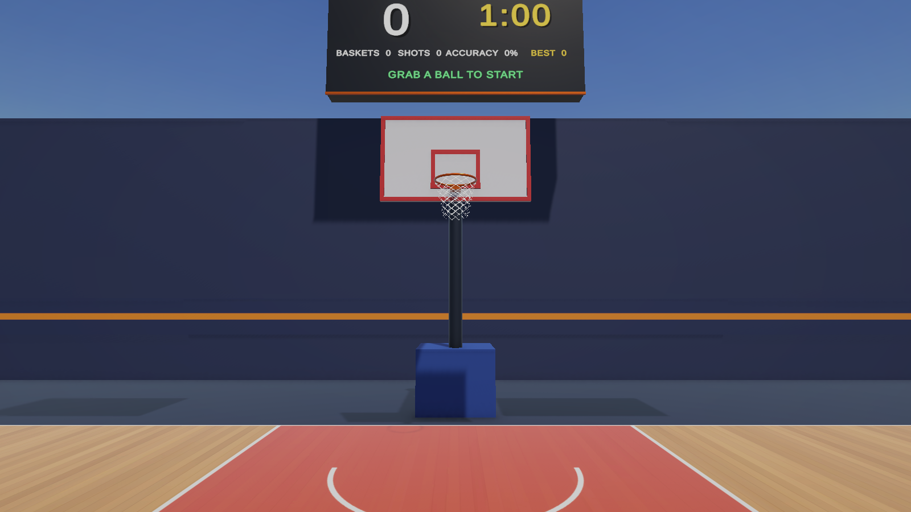
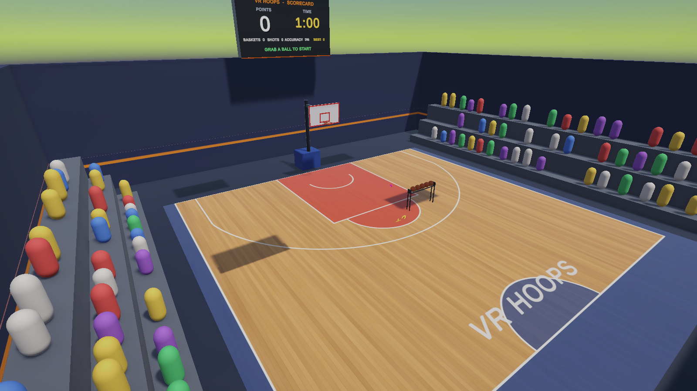
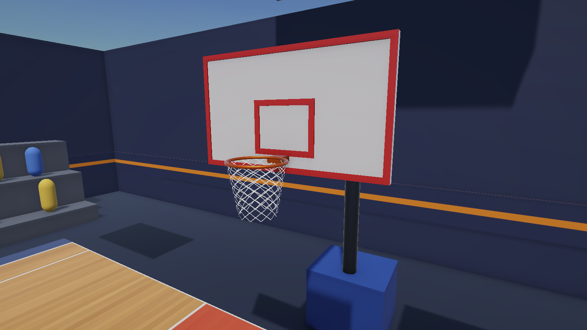

# VR Basketball (Unity XR)

A single-player VR basketball game made with Unity, OpenXR and the XR Interaction Toolkit. Grab balls from the rack and score as many baskets as you can in a 60-second round. The scorecard shows points, baskets, shots, accuracy, time and best score.

## Features
- Indoor half court: maple floor, painted key, free-throw circle, 3-point arc, bleachers
- Regulation hoop (3.05 m) with a physical rim, backboard and swishing net
- A basket counts only when the ball drops down through the rim: 2 points, 3 from beyond the arc
- Rack of 5 balls that return automatically; 60-second rounds; best score saved
- Scoreboard plus in-view HUD, confetti, crowd and buzzer sounds
- Shot assist (toggle with H on PC)
- **Desktop Mode** with a power meter and green zone
- PlayMode tests with real ball physics

## Controls
| Input | Action |
|---|---|
| Grip (VR) | Grab a ball (also at a distance) |
| Throw and release (VR) | Shoot |
| Click / E (PC) | Pick up a ball |
| Hold and release left click (PC) | Shoot (release in the green zone) |
| H (PC) | Toggle shot assist |

## Open the project
1. Install **Unity 6000.4.0f1** (Unity 6) with Unity Hub (add **Android Build Support** for Meta Quest).
2. Unity Hub -> **Add -> Add project from disk** -> select this folder.
3. Open `Assets/Scenes/VRBasketball.unity` and press **Play**.

## Build
Menu **VR Basketball -> Build Quest APK / Build Windows**.

## Main scripts
`BasketballGame`, `Ball`, `Hoop`, `HoopTrigger`, `ShotAssist`, `Scoreboard`, `AudioFX`, `DesktopMode` (in `Assets/Scripts`). The editor builder in `Assets/Scripts/Editor` generates the scene, materials and prefabs.

## Tests
Run **Window -> General -> Test Runner -> PlayMode -> Run All**.

Built with **Unity 6000.4.0f1**.
